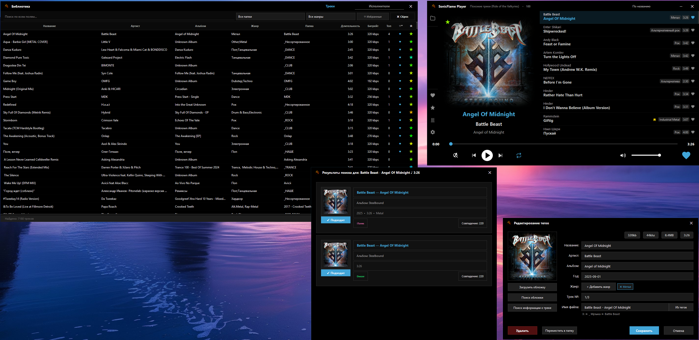

# SonicFlame Player

Modern desktop audio player with a GUI built on Python (PySide6/Qt6).



## Features

[Technical documentation](TECHNICAL.md)

### Playback
- Supports MP3, FLAC, M4A/MP4 formats
- Play/Pause, Next, Previous
- Repeat modes: none, all, one
- Seek bar with time labels
- Volume control with mute toggle
- System media keys (play/pause, next, prev)
- Auto-switch audio output device when connected
- Load all tracks by current artist
- Find similar tracks (genre, tempo, energy, mood)
- Favorites toggle (heart button)
- Top listened (top 100 by play count)
- Windows SMTC integration (media overlay)
- Prevent sleep during playback
- Manual audio output device selection

### Interface
- Frameless window with custom title bar
- Dark theme with smooth transitions
- Customizable accent color (15 presets)
- Dynamic accent color from album art palette
- Album art with ambient blur effect
- Mood star overlay (tempo, energy, mood colors)
- Playlist with auto-scroll to current track
- Playlist sort modes: artist, title, newest, shuffle
- Sort mode persisted in config, applies to all playlists
- Active track highlight preserved after sort change
- Sidebar: open folder, all music, favorites, top, settings, library
- System tray icon with context menu
- Minimize to tray with mini-player widget
- Mini-widget opacity setting
- Custom frameless dialogs with accent border
- Custom folder picker with tree view, quick filter, key folders sidebar
- Styled message boxes (info, warning, error, question)
- Scanning animation with blinking status label

### Library & Organization
- SQLite database (WAL mode) for track storage
- Folder scanning with metadata extraction
- Smart sync — detects file changes, auto-updates DB
- Track mood analysis (tempo, energy, mood) via librosa (async)
- Artists view with cover collages (2x2 grid)
- Artist card with hover animation
- Artist cache for fast loading
- Favorites management
- Top listened tracking (play count per track)
- Folder-based browsing with track counting
- Paginated library view (250 items per page)
- Filter by folder, genre, or search query
- DB cleanup for tracks with missing files
- Force refresh library cache
- Library as a separate subprocess
- IPC communication between player and library (QLocalSocket)

### Settings Dialog (5 pages)
- **Main page**: root music folder, similarity precision slider
- **Appearance page**: 15 accent presets, dynamic color toggle, mini-widget toggle & opacity
- **Web Server page**: enable toggle, port with validator (1024-65535), QR code, remote shutdown toggle
- **System page**: sleep blocker, audio output device combobox, DB cleanup button
- **About page**: app name & version, author info, GitHub & website links

### Tag Editor
- Edit: title, artist, album, genre, year, track number
- Online track info search (iTunes, Deezer API)
- Online cover art search and download
- Abstract cover generation from background images
- Rename file from tags
- Move track to another folder
- Genre delimiters: `;`, `,`, `/`
- Async saving with loading spinner

### Web Server for Remote Control
- Built-in HTTP server (aiohttp) on configurable port
- Responsive web interface (desktop + mobile)
- REST API for external control
- Real-time playback status polling (1000ms)
- Playback controls: Play/Pause, Next/Previous, Seek, Volume
- Playlist loading: folders, Favorites, Top, Similar Tracks
- Cover display (base64), title, artist, album
- Folder selection from indexed list
- QR code for easy connection
- Offline detection with notification overlay
- IP filtering (local/private addresses only)
- Security headers (X-Content-Type-Options, X-Frame-Options, X-XSS-Protection)

### Android App for Remote Control
- Playback controls: Play/Pause, Next, Previous
- Repeat mode toggle, favorites toggle
- Seek bar and volume control
- Dark theme with dynamic accent color
- Playlists: folders, Top, Favorites, Full Library (5000+ tracks)
- Connection via QR code scan or manual IP:PORT
- Download on Website: [sonicflame.pro](https:///sonicflame.pro) 

## Installation

```bash
pip install -r requirements.txt
```

## Running

```bash
python main.py
```

To open the library in a separate window:
```bash
python main.py --library
```

## Requirements

In [TECHNICAL.md](TECHNICAL.md#requirements)

## Color Scheme

- Background: `#000000` (black)
- Text: `#FFFFFF` (white)
- Accent: `#ed6a02` (customizable)

## License

GNU General Public License v3.0 (GPL v3)

## Contacts

**Author:** ramzes ([smartoff.net](https://smartoff.net))  
**GitHub:** [ramzes-s](https://github.com/ramzes-s)  
**Website:** [sonicflame.pro](https:///sonicflame.pro)  
**E-mail:** [ramzes@sonicflame.pro](mailto:ramzes@sonicflame.pro)

---

# SonicFlame Player

Современный десктопный аудиоплеер с графическим интерфейсом на Python (PySide6/Qt6).

## Возможности

[Техническая документация](TECHNICAL.md)

### Воспроизведение
- Поддержка форматов MP3, FLAC, M4A/MP4
- Play/Pause, Next, Previous
- Режимы повтора: none, all, one
- Seek bar с временными метками
- Регулятор громкости с mute
- Системные медиа-клавиши (play/pause, next, prev)
- Автопереключение аудиоустройства при подключении
- Все треки текущего исполнителя
- Похожие треки (жанр, темп, энергия, настроение)
- Избранное (кнопка сердца)
- Топ прослушиваний (топ-100 по счётчику)
- Интеграция SMTC Windows (медиа-оверлей)
- Блокировка сна во время воспроизведения
- Выбор устройства вывода звука

### Интерфейс
- Безрамочное окно с кастомным title bar
- Тёмная тема с плавными переходами
- Настраиваемый акцентный цвет (15 пресетов)
- Динамический цвет из палитры обложки
- Обложка с эффектом ambient blur
- Звезда настроения (tempo, energy, mood)
- Плейлист с автоскроллом к текущему треку
- Сортировка плейлиста: исполнитель, название, новизна, перемешать
- Режим сортировки сохраняется в конфиге
- Подсветка активного трека после смены сортировки
- Боковая панель: открыть папку, вся музыка, избранное, топ, настройки, библиотека
- Иконка в системном трее с контекстным меню
- Сворачивание в трей с мини-плеером
- Настройка прозрачности мини-плеера
- Кастомные frameless-диалоги с акцентной рамкой
- Кастомный выбор папки с деревом, фильтром, списком ключевых папок
- Стилизованные message box (info, warning, error, question)
- Анимация сканирования с мигающим статусом

### Библиотека и организация
- SQLite база данных (WAL mode)
- Сканирование папок с извлечением метаданных
- Умный sync — отслеживание изменений, автообновление БД
- Анализ настроения трека (tempo, energy, mood) через librosa (асинхронно)
- Представление "Исполнители" с коллажами обложек (2x2)
- Карточка исполнителя с анимацией при наведении
- Кеш исполнителей для быстрой загрузки
- Управление избранным
- Топ прослушиваний (счётчик на трек)
- Навигация по папкам со счётчиком треков
- Пагинация в библиотеке (250 элементов)
- Фильтр по папке, жанру или поиску
- Очистка БД от отсутствующих файлов
- Принудительное обновление кеша библиотеки
- Библиотека как отдельный субпроцесс
- IPC связь между плеером и библиотекой (QLocalSocket)

### Диалог настроек (5 страниц)
- **Главная**: корневая папка, точность похожих треков
- **Внешний вид**: 15 пресетов акцента, динамический цвет, мини-плеер и прозрачность
- **Веб-сервер**: вкл/выкл, порт с валидатором (1024-65535), QR-код, удалённое закрытие
- **Система**: блокировка сна, устройство вывода, очистка БД
- **О программе**: название, версия, автор, ссылки GitHub и сайт

### Редактор тегов
- Редактирование: title, artist, album, genre, year, номер трека
- Поиск информации онлайн (iTunes, Deezer API)
- Поиск и загрузка обложек онлайн
- Генерация абстрактной обложки из фоновых изображений
- Переименование файла из тегов
- Перемещение трека в другую папку
- Разделители жанров: `;`, `,`, `/`
- Асинхронное сохранение с индикатором загрузки

### Веб-сервер для удалённого управления
- Встроенный HTTP-сервер (aiohttp) на настраиваемом порту
- Адаптивный веб-интерфейс (desktop + mobile)
- REST API для внешнего управления
- Статус воспроизведения в реальном времени (polling 1000мс)
- Управление: Play/Pause, Next/Previous, Seek, Volume
- Загрузка плейлистов: папки, Избранное, Топ, Похожие
- Обложка (base64), название, артист, альбом
- Выбор папки из списка
- QR-код для быстрого подключения
- Offline detection с уведомлением
- IP-фильтрация (только локальные/приватные адреса)
- Security headers (X-Content-Type-Options, X-Frame-Options, X-XSS-Protection)

### Android-приложение для удалённого управления
- Управление: Play/Pause, Next, Previous
- Повтор, избранное
- Seek bar и громкость
- Тёмная тема с динамическим акцентным цветом
- Плейлисты: папки, Топ, Избранное, Вся библиотека (5000+)
- Подключение по QR-коду или вручную (IP:PORT)
- Скачайте на сайте: [sonicflame.pro](https:///sonicflame.pro) 

## Установка

```bash
pip install -r requirements.txt
```

## Запуск

```bash
python main.py
```

Для запуска библиотеки в отдельном окне:
```bash
python main.py --library
```

## Требования

В [TECHNICAL.md](TECHNICAL.md#requirements)

## Цветовая схема

- Фон: `#000000` (чёрный)
- Текст: `#FFFFFF` (белый)
- Акцент: `#ed6a02` (настраиваемый)

## Лицензия

GNU General Public License v3.0 (GPL v3)

## Контакты

**Автор:** ramzes ([smartoff.net](https://smartoff.net))  
**GitHub:** [ramzes-s](https://github.com/ramzes-s)  
**Сайт:** [sonicflame.pro](https:///sonicflame.pro)  
**E-mail:** [ramzes@sonicflame.pro](mailto:ramzes@sonicflame.pro)
